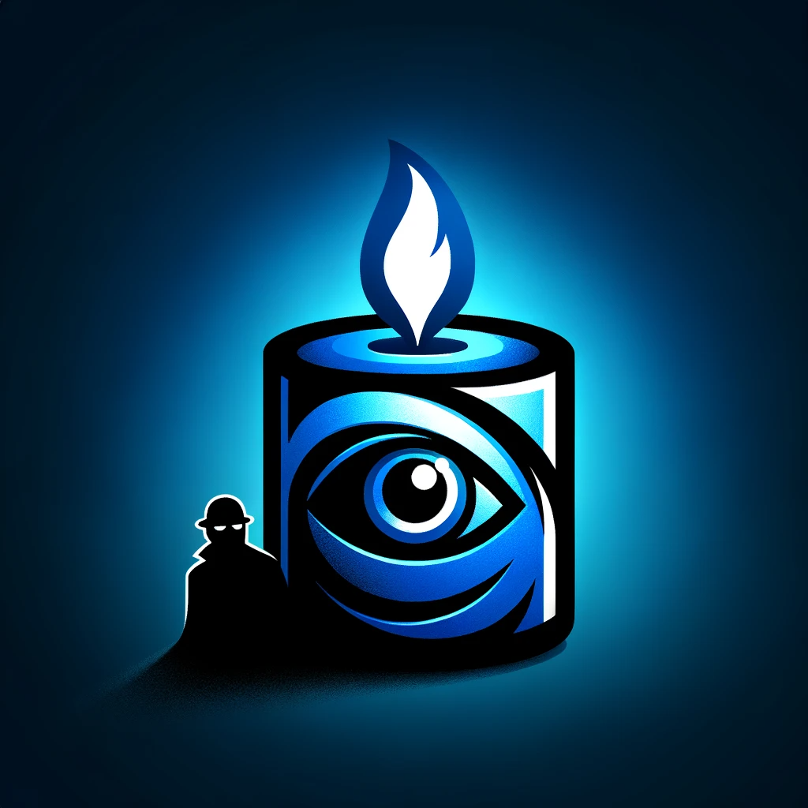
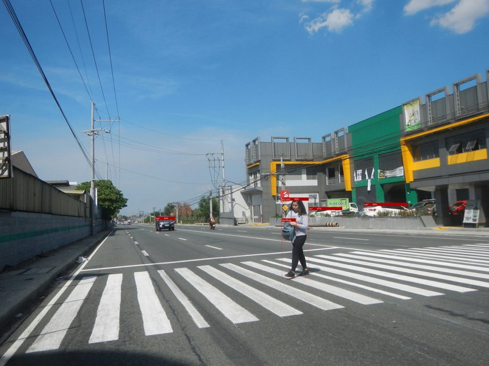

# Blue Candle

## TL;DR

- Object detection service
- [Yolo8](https://github.com/ultralytics/ultralytics) inference implementation
- One small binary < 20 MB with one built in model.
- Dockerless
- [Blue Iris](https://blueirissoftware.com/) and [Agent DVR](https://www.ispyconnect.com) API compatible.

---



---

## About Blue Candle

Blue Candle is a streamlined, Windows-compatible object detection service designed for integration with Blue Iris and Agent DVR. At its core, Blue Candle leverages the power and simplicity of Yolo 8 models, ensuring efficient and accurate detection capabilities. The service is dockerless, making it easily deployable in various environments.

Written in Rust, Blue Candle promises high performance and reliability. It uses Axum for its web framework, ensuring a robust and scalable web interface. For machine learning operations, Candle is employed as the backend.

The Yolo model implementation in Blue Candle is based on examples found in Candle which in turn is based on Tinygrad implementation.

Our goal with Blue Candle is to provide an accessible, user-friendly, and efficient object detection solution that can seamlessly integrate with your existing home automation setup.

---

## Installation and Getting Started with Blue Candle

## Installation

1. **Download the Release:**
   - Visit the [Blue Candle releases page](https://github.com/xnorpx/blue-candle/releases/latest) to download the latest version. There are versions available for both CPU and CUDA (GPU).

2. **Check CUDA Compatibility:**
   - If you are using the CUDA version, ensure your GPU is compatible. Blue Candle supports compute capabilities 6.1 or higher. You can check your GPU's compute capability on the [NVIDIA CUDA GPUs page](https://developer.nvidia.com/cuda-gpus). Also ensure you
   have [NVIDIA CUDA Toolkit](https://developer.nvidia.com/cuda-downloads) installed. Currently we pre-build binaries for CUDA 11 and CUDA 12. Make sure to have the bin directory in path so that Blue-candle can find the Cuda shared libraries.

3. **Choose the Correct Release:**
   - Download the appropriate version for your system (CPU or CUDA). For CUDA, select the release that matches your GPU's compute capability. If your target platform is not available pre-built please file a ticket.

## Getting Started

### Running Blue Candle

1. **Open Command Prompt:**
   - Navigate to the directory where you have downloaded and extracted Blue Candle.

2. **Blue Candle help:**
   - Run the following command to get started with Blue Candle:

     ```bash
     blue_candle --help
     ```

   - This command will display the usage and options for Blue Candle.

3. **Simple Blue Candle start:**
   - Run the following command to get started with Blue Candle:

     ```bash
     blue_candle
     ```

   - This command will start blue candle and start running on the default port 32168. And you should see the following

     ```bash
     20XX-XX-03T21:33:24.318128Z  INFO blue_candle::detector: Detector is initialized for GPU
     20XX-XX-03T21:33:24.608722Z  INFO blue_candle::detector: Test detection
     20XX-XX-03T21:33:25.090863Z  INFO blue_candle: Server inference startup test, processing time: 481.8493ms, inference time: 119.6684ms
     20XX-XX-03T21:33:25.091261Z  INFO blue_candle: Starting server, listening on 0.0.0.0:32168
     20XX-XX-03T21:34:36.102087Z  INFO blue_candle: Request time 369.0577ms, processing time: 362.837ms, inference time: 80.253ms
     ```

### Command Line Interface (CLI) Options

- **Labels Filter:**
  - Use `--labels "label1,label2"` to filter results to include only specified labels.

- **Port Selection:**
  - Use `--port [PORT_NUMBER]` to set the port for HTTP requests. Default is 32168.

- **CPU Mode:**
  - Use `--cpu` to force the application to use CPU instead of GPU.

- **Confidence Threshold:**
  - Use `--confidence-threshold [VALUE]` to set the confidence threshold for model predictions. Default is 0.25.

- **Non-Maximum Suppression Threshold:**
  - Use `--nms-threshold [VALUE]` to set the NMS threshold. Default is 0.45.

- **Legend Size in Images:**
  - Use `--legend-size [SIZE]` to set the font size of the legend in saved images. Set to 0 to disable.

- **Model Path:**
  - Use `--model-path "./models"` to specify the directory to download other YOLO8 models.

- **Model Selection:**
  - Use `--model "/path/to/model.safetensors"` to specify the path to the model weights file.

- **Image Path:**
  - Use `--image-path "/path/to/save/images"` to specify where to save processed images.

- **Test Image:**
  - Use `--image "/path/to/test.jpg"` to run object detection on a specific image.

### Example Command

```bash
blue_candle --port 8080 --labels "person,car" --model "/path/to/model.safetensors" --image "/path/to/test.jpg"
```

This command runs Blue Candle on port 8080, filtering results to include only "person" and "car" labels, using a specified model, and processing a specific test image.

---

Remember to replace the file paths and options in the example commands with those that are applicable to your setup.

Certainly, I'll add a section to the README.md that includes the image 'crossing-od' as the output of a given command, and I'll include the citation for the picture as well.

---

### Object Detection Output

The following command was executed to perform a test object detection:

```bash
blue_candle -- --test
```

Output from the command:

```bash
20XX-XX-03T21:43:43.483778Z  INFO blue_candle::detector: Detector is initialized for GPU
20XX-XX-03T21:43:43.785153Z  INFO blue_candle::detector: Test detection
20XX-XX-03T21:43:45.255355Z  INFO blue_candle: Tested image in 1.4702015s, processing time: 479.6861ms, inference time: 117.6626ms
```

The image below is the result of the object detection test:



- **Source:** [Wikipedia - Pedestrian Crossing](https://en.wikipedia.org/wiki/Pedestrian_crossing#/media/File:4876Maduya,_Carmona,_Cavite_Landmarks_33.jpg)

### Build yourself

1. Install [Git](<https://git-scm.com/book/en/v2/Getting-Started-Installing-Git>).
2. Follow the instructions for your operating system.
3. Install [Rust](https://www.rust-lang.org/tools/install).
4. After installation, restart your terminal or command prompt.
5. Verify the installation with `rustc --version`.
6. Clone the repo: `git clone https://github.com/xnorpx/blue-candle`
7. `cd blue-candle`
8. `cargo run --release -- --help` to list help
9. `cargo run --release -- --test` to runs self test
10. `cargo run --release` to run server
11. For CUDA support then do `cargo run --release --features cuda -- --test`

Certainly! I'll integrate the instructions for building the test client with the previous instructions for using it, making the section more concise.

---

## Using and Building the Test Client for Blue Candle

The test client is a tool designed for benchmarking and testing the object detection service of Blue Candle. Before using it, you need to build the client, and then you can run it with various options.

### Building the Test Client

- **Prerequisite:** Ensure [Rust and Cargo](https://www.rust-lang.org/tools/install) are installed on your system.
- **Build Command:** In the root directory of the Blue Candle source code, run `cargo build --bin test_ob_service`. This compiles the test client.

### Running the Test Client

1. **Locate the Executable:** After building, find `test_ob_service.exe` (or `test_ob_service` on non-Windows) in the `target/debug` directory.
2. **Launch the Client:** Open a command prompt in the directory containing the executable.
3. **Execute the Client:** Use `test_ob_service --help` to view usage and options.

### Test Client CLI Options

- **Origin:** `-o` or `--origin [URL]` (default: `http://127.0.0.1:32168`).
- **Min Confidence:** `--min-confidence [VALUE]` (default: 0.6).
- **Image Input:** `-i` or `--image [IMAGE_PATH]` for optional image input.
- **Image Output with BBox:** `--image-ob [IMAGE_PATH]` to save the image with bounding boxes.
- **Number of Requests:** `-n` or `--number-of-requests [NUMBER]` (default: 1).
- **Request Interval:** `-i` or `--interval [MILLISECONDS]` (default: 1000).
- **Help and Version:** `-h` or `--help`, `-V` or `--version`.

### Example Usage

```bash
test_ob_service -o http://127.0.0.1:32168 --min-confidence 0.7 --image "/path/to/test_image.jpg" --number-of-requests 5 --interval 500
```

This command sets the service origin, minimum confidence level, test image path, number of requests, and interval between requests.

---

## License

This project is dual-licensed under both the Apache License 2.0 and the MIT License, offering flexibility and broad compatibility with various licensing requirements for most of the code. However, specific components related to the Yolo8 model are licensed under the Affero General Public License (AGPL) due to their dependency on Ultralytics Yolo8, which is AGPL-licensed.

By using, modifying, or distributing any part of this project, you agree to comply with the terms of the respective licenses for each component:

- For the Yolo8 model components: [AGPL License](https://www.gnu.org/licenses/agpl-3.0.en.html)
- For all other components of the project: [Apache License 2.0](https://opensource.org/licenses/Apache-2.0) and [MIT License](https://opensource.org/licenses/MIT)

---

## Acknowledgments

- Blue Iris Software: [Blue Iris](https://blueirissoftware.com/)
- Agent DVR: [Agent DVR](https://www.ispyconnect.com/)
- ML Backend: [Candle](https://github.com/huggingface/candle)
- Yolo 8 Model: [Ultralytics](https://github.com/ultralytics/ultralytics)
- Yolo Model Inspiration: [Tinygrad](https://github.com/tinygrad/tinygrad)
- Web Framework: [Axum](https://github.com/tokio-rs/axum)

---

<!-- markdownlint-disable MD033 -->
<sub>Logo generated by OpenAI's DALL-E, an AI image generation tool.</sub>
